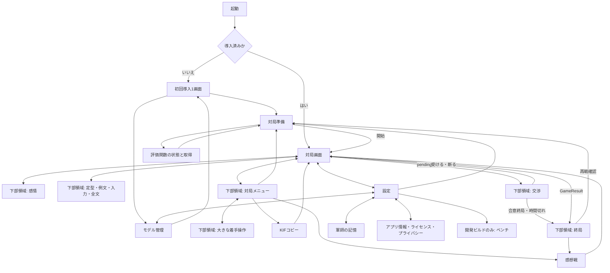

# 画面構成・設定・遷移

この文書で確定したこと
- 対局は盤を固定し、詳細・会話・交渉は盤と重ならない下部領域で開く。
- 表示領域の幅・高さから盤サイズを計算し、文字拡大で全体を縦に押し出さない。
- 設定は対局／軍師／表示／音と触覚／データ／その他に分ける。
- 初回導入は1画面、モデルのダウンロードは任意とする。
- 終局は結果カードを盤の下に出し、感想戦と再戦へ接続する。

策定日: 2026-09-20。コード照合基準 `619e9af`。関連: [HUD](04-hud.md)、[色と部品](03-visual-system.md)、[フィードバック](06-feedback.md)。この文書に書かれた新画面・設定は今後のUI実装仕様であり、現時点の搭載済み機能ではない。

## 共通の画面枠

アプリは縦向き、SafeArea内で最大幅520dp、中央寄せ。通常画面のAppBarは48dp（タイトル20sp、1行、戻る48×48dp）、本文余白16dp、行間8dp、節間24dp。設定・感想戦・モデル・アプリ情報は縦スクロールする。根拠: 長文の説明と設定を対局画面から分離する。

対局AppBarは「煽り将棋」＋設定アイコン1個だけにする。既存の感想戦・モデル・記憶・KIF・アプリ情報は設定または対局メニューに移す。根拠: 幅360dpでアイコン5個と見出しが競合する状態を解消する。

## 対局画面の寸法契約

WはSafeArea内の幅を520dpで上限にした値。HはSafeAreaと48dpのAppBarを除き、キーボードが出ている場合はその高さも除いた残り高さ。左右paddingは8dp。盤は必ず正方形、中央寄せとする。

取引中はHUDに48dpの補足行を追加し、盤辺から同じ48dpを差し引く。補足は「約束：あとN手・口軽X／漏れた読みが真実とは限りません」。根拠: 取引の価値に関わる口軽を詳細画面だけへ隠さない。

### 通常時

| ブロック | 標準 | コンパクト | 根拠 |
|---|---:|---:|---|
| 軍師HUD | 152dp | 72dp | 標準は顔＋発話＋3本のバー、低い端末では数値に集約 |
| 盤状態帯 | 48dp | 48dp | 状態と時計の2行を保持 |
| 後手駒台 | 48dp | 48dp | 持ち駒を48dpの操作領域で扱う |
| 後手駒台→盤 | 4dp | 4dp | 誤認を避ける境界 |
| 盤→先手駒台 | 4dp | 4dp | 同上 |
| 先手駒台 | 48dp | 48dp | 7種は横スクロール、各48dp |
| 先手駒台→操作列 | 8dp | 8dp | 親指操作の区切り |
| 操作列 | 48dp | 48dp | 感情・煽る・メニューの3等分 |
| 盤以外の合計 | 360dp | 280dp | 高さの算術を固定 |

標準はH≥(W−16)+360dpの場合のみ使い、盤辺B=W−16dp。その他はコンパクトを使い、B=min(W−16,H−280)dp。余った縦の空白はHUDと状態帯の間に置き、盤と操作列を画面下へ揃える。根拠: よく触る場所を親指側に寄せる。

標準HUDは内側8dp、上段72dp、段間8dp、下段56dp、下余白8dpで合計152dp。上段は顔72dp＋横間隔8dp＋右列。右列は気分・Stanceを24dpの1行にまとめ、8dp空け、主要3値を幅均等の3列に置く（各列はラベル＋数値24dp、間隔8dp、バー8dp、合計40dp）。右列全体は24+8+40=72dp。下段は14spの2行発話と全文ボタン48×48dp。Stanceが気分と並ばない幅ではStanceを詳細に移す。詳細な縦5行バーは感情領域で表示する。根拠: 360dp幅で発話とメーターを無理に同じ列へ押し込まない。

コンパクトHUDは顔72dp、間隔8dp、右に①気分12sp・24dp、②3値12sp・20dp、③発話14sp・28dp。Stanceは感情詳細へ移す。全文を開く操作は発話だけに小さいボタンを置かず、右列全体を48dp以上のタップ領域とする。根拠: 72dpに3値と発話の手がかりを残す。文字拡大時の80dp枠では顔は上揃えの72dpを維持する。

```text
┌────────── 煽り将棋 ── 設定 ┐ 48
│ 顔72 │ 気分／主要3値／発話 │ HUD
│ 状態：自分の番・王手       │ 48（時計含む）
│ △ 持ち駒                  │ 48
│          9×9の盤          │ B
│ ▲ 持ち駒                  │ 48
│ 感情   │ 煽る  │ メニュー │ 48
└───────────────────────────┘
```

### 下部領域を開くとき

領域はオーバーレイのmodal bottom sheetにせず、盤の下に高さを予約して置く。開いている間は軍師HUDと駒台を畳み、上から状態帯48dp／盤B／間隔8dp／下部領域Pとする。B=min(W−16,H−P−56)。下部領域は次の高さ、本文のみ縦スクロール、ヘッダーと操作部を固定する。

| 領域 | P | 固定部分 | 内容・根拠 |
|---|---|---|---|
| 感情／全文／メニュー | min(320,H−152)dp | ヘッダー48dp（戻る含む） | 残りを一覧にし、盤に最低96dp残す |
| 定型・例文 | min(320,H−152)dp | ヘッダー48dp＋タブ48dp | 残りは内容スクロール |
| 自由入力、キーボードなし | min(320,H−152)dp | ヘッダー48dp＋送信行56dp | 残りに会話と入力 |
| 自由入力、キーボードあり | 104dp | 戻る／「入力」48dp＋入力・送信56dp | H≥256なら盤≥96dpを確保 |
| 交渉 | min(320,H−152)dp | ヘッダー48dp＋受諾／拒否96dp | 全文だけスクロール、返答を隠さない |
| 終局 | min(320,H−152)dp | ヘッダー48dp＋操作96dp | 結果と発話をスクロール |

H<392dpで交渉が来たらキーボードを閉じて通常高を回復する。キーボード表示でH<256dpになった場合はキーボードを閉じ、「入力に必要な高さが不足しています。例文を利用できます」と表示して例文タブに戻す。根拠: 盤が消えるまで縮めたり、キーボードに送信を隠したりしない。自由入力中の盤は参照表示とし、閉じる操作で元の大きさと選択に戻る。

下部領域を開いても時計は停止しない。状態帯の時計表示を維持する。設定など別画面へ移動する場合も同じ。対局中は遷移先の上端に「対局中・時計は進みます／対局へ戻る」最小48dpを出す。

### 小画面・文字拡大の算術

| 条件 | H | 配置 | B・結論 |
|---|---:|---|---|
| 360×640dp、上下SafeArea各24dp、AppBar48dp | 544dp | コンパクト | min(344,264)=264dp、合計544dp |
| 360×800dp、同じ余白 | 704dp | 標準 | 344dp＋360dp=704dp |
| 520×900dp、同じ余白 | 804dp | コンパクト | min(504,524)=504dp、余り20dp |
| H=544dpで交渉 | 544dp | P=320dp | B=168dp、合計544dp、盤の全体と返答を同時表示 |
| H=544dp、キーボード280dp | 264dp | 入力P=104dp | B=104dp、参照盤が残る |
| 360dp幅、文字1.3倍 | 同じ | コンパクト右列264dp | 12spの1行21.84dp、発話27.3dp。3値は20dp枠を24dpにし発話を32dpにしてHUDを80dpへ拡張、Bを8dp減らす |

文字倍率>1.0のコンパクトHUDは80dp（24+24+32）、盤以外288dpに置換する。1.3倍・H544なら盤256dp。標準はラベル行を24dp、発話2行56dpに収め、長い表示名は詳細に移す。気分とStanceの同時表示が横幅を超える場合はStanceのみ詳細へ移す。根拠: 日本語の幅を縮めない。

H<376dpかつキーボードなしではHUD・駒台を畳む参照盤モードを使い、状態48dp／盤最大W−16dp／操作48dpの順に置く。B=min(W−16,H−104)dp。持ち駒と着手は次の代替入力で操作する。H<200dpの極端な分割画面は「画面を広げて対局してください」を出し、盤の参照だけ残す。根拠: 最低高さが指定されていない依頼を無制限に成立すると主張しない。

## 48dpのタップ領域と盤

360dpに9列×48dp=432dpは入らない。通常の盤の直接タップはB/9dpであり、全マス48dpの要件は物理的に満たせない。実機での押しやすさは未承認の暫定方式とし、盤タップと代替入力を実機で比較する。自動タップの成功を日常操作の快適さの承認としない。この例外を隠さず、大きな操作領域で同じ一手を指せる「大きな着手操作」をメニューの先頭に必ず設ける。

代替入力は下部領域を使い、盤全体を参照表示として維持。第1段階は手番側の駒を「7七の歩」等の最小48dp高のリストで選択（持ち駒も末尾に列挙）。第2段階は既存legalTargetsの移動先を「7六へ」等の48dp行で選択。成／不成は既存候補から選ぶ。盤面・候補は同じcontrollerの値を使い、UI独自の合法手計算はしない。戻る48dpで選択段階へ戻る。TalkBack/VoiceOverは同じ経路を利用できる。根拠: 重なる48dpヒット領域を盤に敷いて誤操作させない。

## 対局メニューと人間同士

| 操作 | 場所・挙動 | 根拠 |
|---|---|---|
| 大きな着手操作 | メニュー先頭、48dp行 | 常に代替操作へ到達できる |
| 待った | 48dp行、controller.undoをそのまま利用 | 自由会話の「待った」依頼と別の既存操作を維持 |
| 投了 | 48dp行→「投了しますか」→戻る／投了 | 取り返しのつかない誤タップを防ぐ |
| 新規対局 | 48dp行→対局準備、進行中なら破棄確認 | 勝手に現在局を消さない |
| 入玉宣言 | declaration.canDeclareかつ人間手番だけ表示→確認→既存declareWin | 適用条件を増やさない |
| 感想戦 | 現在のreviewを表示、未記録は説明 | 新しい解析を勝手に走らせない |
| KIFをコピー | 現在局をClipboardへ、結果を視覚通知 | 既存の書き出し機能を保つ |

humanではHUDと感情・煽るを消し、操作列を「着手操作／対局メニュー」の2等分にする。盤以外は状態48＋駒台96＋間隔16＋操作48=208dp、B=min(W−16,H−208)。先手は下、後手は上の既存向きを維持し、毎手の盤反転はしない。aiBothも軍師個人のHUDを出さず、このレイアウトで状態を「AI同士・観戦」とする。根拠: gunshiSideがnullのモードで架空の感情を作らない。

## 設定の採否と適用時点

採用はUI実装時の目標。「固定／不採用」は無効な設定行を並べず、必要な説明だけ表示する。設定保存は端末内、表示・音の設定は即時反映し、アプリを再起動しても保持する。根拠: ゲームで一般的な項目を洗い出した上で、現行ロジックを変えるスイッチを設けない。

| 階層／項目 | 採否・選択肢 | 既定値 | 対局中に変更した時 | 根拠 |
|---|---|---|---|---|
| 対局／相手 | 採用、下表4値 | `human`（既存初期値） | この項目は準備画面だけ編集可。現在局には適用しない | setModeの途中変更を避ける |
| 対局／強さ | 採用、下表5値 | `normal` | 同上、次の新規対局で適用 | 思考中の条件変更を避ける |
| 対局／時間 | 採用、none／threeMinutes／tenMinutes | none | 同上、既存setTimeControlは時計をリセットするので対局中は編集不可 | 時間を戻す事故を防ぐ |
| 対局／成り確認 | 固定、任意成りで必須 | ON | 変更不可、強制成りは既存候補1個で確定 | 合法手・選択を維持 |
| 対局／投了確認 | 採用、ON/OFF | ON | 次回投了操作から適用 | 誤タップ保護 |
| 軍師／煽り頻度 | 固定、既存の発話トリガと1手3回 | 現行 | 編集不可 | 感情ルールの変更になる |
| 軍師／セリフ長 | 固定、全文保持＋HUD抜粋 | 現行 | 編集不可 | 生成長制御を増やさない |
| 軍師／LLM／定型文 | モデル管理への導線を採用、独立トグルは不採用 | 未導入なら定型文、既存導入済みなら現行状態 | 対局中の導入・削除は不可、未着手の準備時または終局後に実行 | speakerの実行中破棄を避ける |
| 軍師／モデル導入・削除 | 採用、[モデル画面](#モデル管理) | 自動導入なし | 説明と容量は閲覧可、変更ボタンは理由付きで非活性 | 1.90GBの取得を強制しない |
| 軍師／記憶閲覧 | 採用 | 現在の端末内記憶 | 即時閲覧 | 現行MemorySheetの移動 |
| 軍師／個別消去・全消去 | 採用、対象を示す確認 | 自動消去なし | 対局中は閲覧のみ。準備／終局後に消去 | 実行中発話へ古い記憶が残る誤認を防ぐ |
| 表示／テーマ | 採用、端末／ライト／ダーク | 端末 | 即時、盤状態を維持 | 明暗双方を提供 |
| 表示／盤と駒 | 固定、現行意匠1種 | 木盤・現行駒 | 編集不可 | 駒字の再設計は対象外 |
| 表示／座標 | 採用、ON/OFF | OFF | 即時、盤を動かさずマス隅に12sp、文字は03のonSurfaceではなく盤用`#24211E` | 目印を任意表示 |
| 表示／最終手 | 採用、ON/OFF | ON | 即時、最終着手先に2dpの角括弧、色だけにしない | 現行lastMoveを使用 |
| 表示／利き | 全利き表示は不採用、選択駒の合法移動先のみ固定ON | 合法移動先のみ | 編集不可 | 新しい盤面解析を追加しない |
| 表示／文字サイズ | 独自倍率は不採用、OS設定を使用 | OS | 復帰時にレイアウト再計算 | 二重倍率を避ける |
| 表示／動き | 採用、OSに従う／減らす | OSに従う | 即時、OS低減を常に優先 | 動きを止めても情報を残す |
| 音／BGM | 不採用、素材0個 | 無音 | 編集不可 | 読みと会話への集中を保つ |
| 音／効果音 | 採用、0～100、10刻み | 60 | 即時、再生中にも反映 | 06の音だけを制御 |
| 音／軍師ボイス | 不採用、素材0個 | なし | 編集不可 | TTS・声優収録は別件 |
| 音／触覚 | 採用、ON/OFF | ON | 即時、端末非対応では説明のみ | 音量と独立して制御 |
| データ／KIF | 現在局のコピーを採用、永続自動保存・ファイル共有は不採用 | 手動コピー | 棋譜スナップショットをコピー、対局は続く | 現行機能の範囲を維持 |
| データ／対局履歴 | 不採用、現在局の感想戦のみ | 永続履歴なし | 編集不可 | 履歴ストレージが未実装 |
| データ／統計 | 不採用 | なし | 編集不可 | 勝率等の新データを捏造しない |
| データ／全データ削除 | 一括は不採用。モデル・記憶の個別削除のみ | なし | 編集不可 | 対象が異なるデータを一括消去しない |
| その他／ライセンス | 採用、既存About＋追加素材通知 | 表示 | 閲覧のみ | GPLv3・第三者通知を維持 |
| その他／プライバシー | 採用、情報ページ | 表示 | 閲覧のみ | 端末内会話と外部ダウンロードを説明 |
| その他／バージョン | 採用、ビルドのversion/build値 | 現在値 | 閲覧のみ | 手書きの版番号を残さない |
| その他／問い合わせ | 採用、About内の既存ソースURLを「サポート情報」として開く | 外部ブラウザ | 対局中は時計継続を表示、無断送信なし | 未確認のメールアドレスを作らない |
| 開発用／ベンチ・ローカル導入・AI同士・探索値 | debugビルドだけ採用 | 閉じる | 同じ既存操作 | 製品画面へ開発情報を出さない |

座標が駒に重なるサイズ（B<324dp）では盤内座標を出さず、盤をタップ／読み上げた時の座標と代替着手リストに表示する。根拠: 12sp×1.3の文字を小マスに重ねない。

### enumの表示対応

| OpponentMode | ラベル | 表示・準備条件 |
|---|---|---|
| `human` | 人間同士 | 常時選択可 |
| `aiWhite` | 軍師が後手（自分は先手） | EngineReadyで開始可 |
| `aiBlack` | 軍師が先手（自分は後手） | EngineReadyで開始可、盤向きは既存を維持 |
| `aiBoth` | AI同士（開発用） | debugかつEngineReady |

| SkillLevel | ラベル | 説明 |
|---|---|---|
| `beginner` | 入門 | 将棋を始めた人向け |
| `easy` | やさしい | 煽りの効果を試したい人向け |
| `normal` | ふつう | 基準の強さ |
| `strong` | 強い | 読みの強い相手 |
| `allOut` | 全力 | 最も強い設定。感情による変調は残る |

段級位や勝率は表示しない。時間の選択肢は時間無制限／3分＋秒読み10秒／10分＋秒読み30秒。根拠: 現行TimeControlの3定数に限定する。

設定行はタイトル・値を2段にし、タップで選択リストを開く（最小48dp行、ラジオ付き）。長い選択肢は折り返す。スライダーには「下げる」「上げる」各48dpボタンと数値を併設する。破棄・削除確認は取り消しを先頭、確定は対象名を含むラベルとする。

## 初回導入・対局準備

初回導入は1画面。「自称・天才軍師との一局」→「煽って冷静を崩す、褒めて慢心させる。感情が動くと指し手も変わります」→「感情を動かせるのは1手3回まで。効き方は局面で変わります」を表示。顔はcomposed。下に「対局を始める」と「軍師の言葉について」の48dpボタンを置く。スキップ相当は「対局を始める」で、チュートリアル操作を強制しない。根拠: ゲーム性を伝えつつ導入を短くする。

初回を閉じた事実だけ保存し、次回は対局画面へ。対局準備は相手／強さ／時間の3項目と「開始」。人間同士が初期選択、ユーザーがAIを選べばNNUE状態を表示する。EngineNeedsDownloadは「ダウンロード約29MB／展開後約64MB（64,217,066bytes）」の評価関数について説明して取得ボタン、Downloadingは実進捗、Startingは不定進捗、Failedはメッセージと再確認、Unsupportedは人間同士の案内。LLMと将棋エンジンのダウンロードを別項目にする。根拠: LLM未導入でも遊べることとAIエンジン必須条件を混同しない。

## モデル管理

1.90GBは1,900,934,064bytesの十進丸め表記とし、利用可能なモデルのspec.bytesを表示する。Wi-Fi推奨、未導入でも定型文で対局可能を常に表示。自動ダウンロードなし、確認後に開始する。

`gunshiFinetuned.url` は照合時点で空。空の間は「学習済み軍師：配布準備中」と説明だけを出し、導入ボタンを出さない。他の既存gunshiModelsは名称・容量・注意書きを保持する。根拠: 配布URLの決定をデザインの完了条件にしない。

| 状態 | 表示・操作 |
|---|---|
| 未導入 | 「いまは定型文で話します」、導入可能なカード |
| 取得中 | モデル名、実際の%、未知なら不定進捗。別モデル導入・削除を無効化 |
| 照合・導入中 | 「モデルを確認しています」、進捗100%でも完了と呼ばない |
| 成功 | 「端末内モデルを使用中」、削除ボタン |
| 失敗 | エラーの短い説明＋「再試行」、定型文で遊ぶ導線 |
| 削除確認 | 「モデルを削除して定型文に戻します」＋戻る／削除 |

取得中に戻ってよい。進行は既存処理に従い、永続バックグラウンド取得やキャンセル／再開を保証しない。次回表示時はストアの実状態を再取得し、完了表示を推測しない。ストレージ不足・通信断は失敗表示へ。UI用に架空の完了率を補間しない。

プライバシー情報は「会話処理と軍師の記憶は端末内」「モデル・評価関数取得時と外部リンク利用時は通信」「記憶とモデルは各管理画面から削除可能」の現行機能説明に限定する。ストア提出用の法的文言や収集データ申告の完了を本仕様で主張しない。

## 終局と感想戦

GameResultが発生したら下部領域を終局へ切り替える。盤は最終局面のまま参照表示、入力不可。勝敗はwinnerとmode.gunshiSideから人間側の結果を決め、Moodやセリフから推測しない。音は[06](06-feedback.md)の重複制御に従う。

| 結果 | 見出し | 顔・発話 |
|---|---|---|
| 人間が勝ち | 「君の勝ち」 | meltdown参照、既存の終局発話 |
| 軍師が勝ち | 「軍師の勝ち」 | smug参照、既存の終局発話 |
| winner=null | 「引き分け」 | coverUp参照、既存発話 |
| human / aiBoth | 「先手の勝ち」「後手の勝ち」「引き分け」 | 軍師の顔と発話なし |

原因の小見出しはGameEndReasonの `checkmate`=詰み、`resign`=投了、`repetition`=千日手、`perpetualCheck`=連続王手の千日手、`agreement`=合意、`declaration`=入玉宣言、`timeUp`=時間切れ。すべて列挙し、勝敗とは別行に表示する。

終局操作は「感想戦へ」「同じ設定で再戦」各48dp、ヘッダーの戻るで盤を大きく表示。メニューの「結果を見る」でカードを再表示できる。再戦は既存newGameを呼ぶ直前に「現在局の棋譜は新規対局で置き換わります。KIFをコピー／再戦／戻る」を表示する。根拠: 永続履歴がない状態で記録が残ると誤解させない。

感想戦は現行ReviewEntryの手数／KIF／lossCp／bestKif／reviewCommentを一覧表示。lossCp=nullは「未解析」、0は「最善」、正数は「N点損」。詳細のない手に解析値を補わない。1行内で収まらなければ数値と説明を2行目以降へ送る。対局画面の全文抜粋とは異なり、ここは省略しない。

## 遷移図



Models→Introは導入から開いた場合の戻るに限る。他は呼び出し元へ戻る。再戦確認後のPrepは同じ設定で開始を実行する通過点とし、条件を変更する場合のみ準備画面を表示する。戻る操作で現局を新規化しない。根拠: 遷移だけでデータを失わせない。

## 受け入れ検証

以下は実装時の確認項目であり、この文書作成時に実機合格を意味しない。

| 条件 | 合格条件 |
|---|---|
| 幅360/520dp、高さ640/800/900dp、文字1.0/1.3、明暗 | overflow0、盤の四隅が対局画面内、全文へ到達可 |
| 100字発話、LLM置換、モデルなし | 盤位置の不意の移動0、送信が偽の待ち状態で止まらない |
| 4種類のOfferKind、時計あり | 理由と返答への導線が盤の直近、時間切れで終局に移る |
| キーボード280dp、自由入力 | 盤全体の参照・送信・閉じるが見える、低すぎる場合は定義済みフォールバック |
| 駒台に7種、文字1.3 | 横スクロールで全種へ到達、各操作48dp以上 |
| TalkBack/VoiceOver、大きな着手操作 | 持ち駒選択・移動・成りまで視覚タップなしで完遂 |
| human / aiWhite / aiBlack / aiBoth | 軍師の有無と先後・勝敗が一致、aiBothはdebug限定 |
| 誤タップ・戻る・連打 | 投了／削除の確認、交渉を隠して停止理由を失うケース0 |

## 未決事項

なし。直接盤タップの全マス48dpは幅360dpと両立しないため例外として明記し、代替入力を必須とした。全マス48dpそのものを絶対条件とする場合は、最小幅を432dp以上へ変更する別判断が必要になる。本仕様の推奨・採用は360dp対応＋代替入力である。
